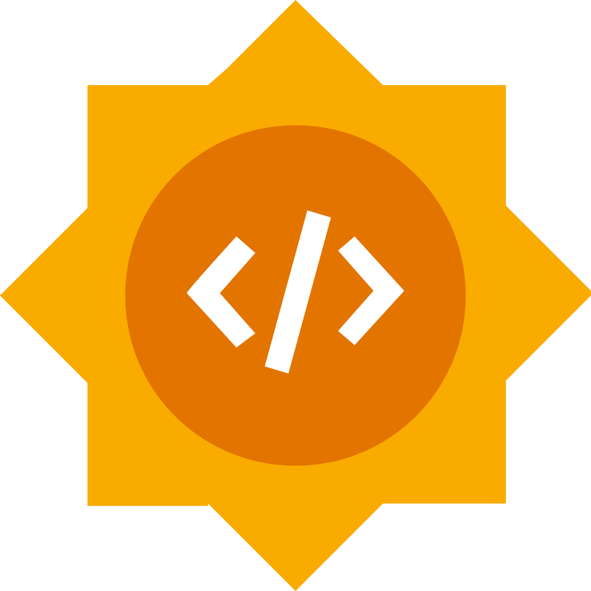

<h1 align="center">VCell BioModel Chatbot Demo</h1>

<p align="center">
  
  
  <br><br>
  <a href="https://share.streamlit.io/KacemMathlouthi/VCell-Demo">
    
  </a>
</p>

This demo presents an intelligent chatbot interface for querying and interpreting biomodels stored in the [VCell BioModel Database](https://vcell.cam.uchc.edu/api/v0/biomodel). It enables users to interact with biological modeling resources using natural language and provides structured outputs, model metadata, downloadable files, and visualizations in real time. This work was developed as a demo for the NRNB Organization for **Google Summer of Code 2025**.

<p align="center">
  
</p>

---

<h1 align="center">Overview</h1>
This chatbot is an AI-powered assistant capable of:
- Interpreting natural language queries
- Extracting structured parameters
- Querying the VCell API
- Summarizing model data in a human-readable way using a large language model (LLM)
- Visualizing model diagrams
- Providing downloadable model files

---

<h1 align="center">Features</h1>

<p align="center">
  
</p>

- **Natural Language Interface** — Query the database with simple English prompts
- **LLM Parameters Extraction** — Uses LLaMA 3 to extract structured parameters
- **VCell API Integration** — Supports dynamic querying with filters like author, category, biomodelid...
- **Summarization** — Generates high-level descriptions of model contents in a human
[gif of parameters extraction, API response and summarization]
- **Visualization** — Displays system reaction diagrams from the API
- **Download Options** — Direct links to SBML and VCML formats for downstream use
[gif of downloading the provided files and visualizations]
- **Streamlit UI** — Minimalist, responsive, and easy to deploy


---

<h1 align="center">Technologies Used</h1>
- Python
- Streamlit
- Groq API for the LLM (LLaMA 3.3-70B)
- VCell Public API
- Pydantic (parameter schema)
- Dotenv (secret management)

---

## Getting Started
### Prerequisites
- Python 3.10 or higher
- A valid Groq API key

### Installation
```bash
git clone https://github.com/KacemMathlouthi/VCell-Demo.git
cd VCell-Demo
python -m venv .venv
source .venv/bin/activate
pip install -r requirements.txt
```

### Configuration

Create a `.env` file at the root of the project:

```env
LLM_API_KEY=your_groq_api_key_here
```

### Run the Application

```bash
streamlit run app.py
```

Visit `http://localhost:8501` to start using the chatbot.

---

## Example Prompts
Here are some questions the chatbot can understand:
- `List all public models by user ion`
- `Find the model with ID 201844485`
- `Show VCell models related to calcium`

---

## Project Structure
```
├── app.py                     # Main application entry point
├── requirements.txt           # Project dependencies
├── .env                       # Environment variable for API key
├── .streamlit/config.toml     # UI configuration
├── vcelldb/
│   ├── vcell_api.py           # Wrapper for VCell API calls
│   ├── diagram.py             # Utilities for diagrams and downloads
│   └── params_model.py        # Schema definitions
└── utils/
    ├── llm_helper.py          # LLM instance creation and response generation
    └── params_extraction.py   # Prompt-to-parameter process
```

---

## License

This project is licensed under the [MIT License](LICENSE). You are free to use, modify, and distribute the software with proper attribution.

Special thanks to the **Virtual Cell (VCell)** team and the **National Resource for Network Biology (NRNB)** for their support.

For more information, visit [vcell.org](https://vcell.org).
