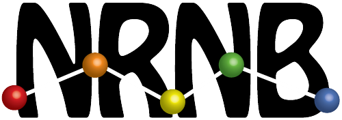

<h1 align="center">VCell BioModel Chatbot Demo</h1>

<p align="center">
  
  
  <br><br>
  <a href="https://kacemath-vcell-demo.hf.space/" target="_blank">
    
  </a>
</p>

---

## Try It Online

You can test the live chatbot application here:

[https://kacemath-vcell-demo.hf.space/](https://kacemath-vcell-demo.hf.space/)

---

## About the Project

This demo presents a chatbot for querying and interpreting BioModels stored in the [VCell BioModel Database](https://vcell.cam.uchc.edu/api/v0/biomodel). Developed as a demo for Google Summer of Code 2025 under the NRNB organization, the app enables users to interact with biological models using natural language, receiving structured outputs, downloadable files, and real-time visualisations.

<p align="center">
  
</p>

---

## Overview

The chatbot can:
- Understand natural language queries
- Extract structured query parameters
- Query the VCell BioModel API
- Generate human-readable summaries using a language model
- Visualise model diagrams
- Provide download links for SBML and VCML files

---

## Features

<p align="center">
  
</p>

- Natural Language Interface — Ask simple questions like “List all models by user ion”
- LLM-Powered Extraction — LLaMA 3 extracts query parameters from your prompt
- VCell API Integration — Dynamically fetches real model data
- Summarisation — Converts raw data into clear, helpful answers
- Visual Diagrams — Renders model reaction networks
- Download Options — Instantly download SBML and VCML formats
- Streamlit UI — Clean, responsive, deploy-ready interface

---

## Technologies Used

- Python 3.10+
- Streamlit
- Groq API (LLaMA 3.3 70B)
- VCell Public API
- Pydantic
- Dotenv

---

## Getting Started

### Prerequisites

- Python 3.10 or later
- A valid Groq API key

### Installation

```bash
git clone https://github.com/KacemMathlouthi/VCell-Demo.git
cd VCell-Demo
python -m venv .venv
source .venv/bin/activate
pip install -r requirements.txt
```

### Configuration

Create a `.env` file at the root with your Groq API key:

```env
LLM_API_KEY=your_groq_api_key_here
```

### Run the App

```bash
streamlit run app.py
```

Visit `http://localhost:8501` in your browser.

---

## Example Prompts

You can ask the chatbot things like:

- `List all public models by user ion`
- `Find the model with ID 201844485`
- `Show VCell models related to calcium`
- `Get educational BioModels created after 2020`

---

## Project Structure

```
VCell-Demo/
├── app.py                     # Main Streamlit app
├── requirements.txt           # Project dependencies
├── .env                       # Environment variables
├── .streamlit/config.toml     # Theme config
├── vcelldb/
│   ├── vcell_api.py           # VCell API wrapper
│   ├── diagram.py             # Diagram & file URL utils
│   └── params_model.py        # Pydantic model schema
└── utils/
    ├── llm_helper.py          # Groq API + LLM prompt handling
    └── params_extraction.py   # Prompt-to-parameter logic
```

---

## License

This project is licensed under the [MIT License](LICENSE). You are free to use, modify, and distribute it with proper attribution.
